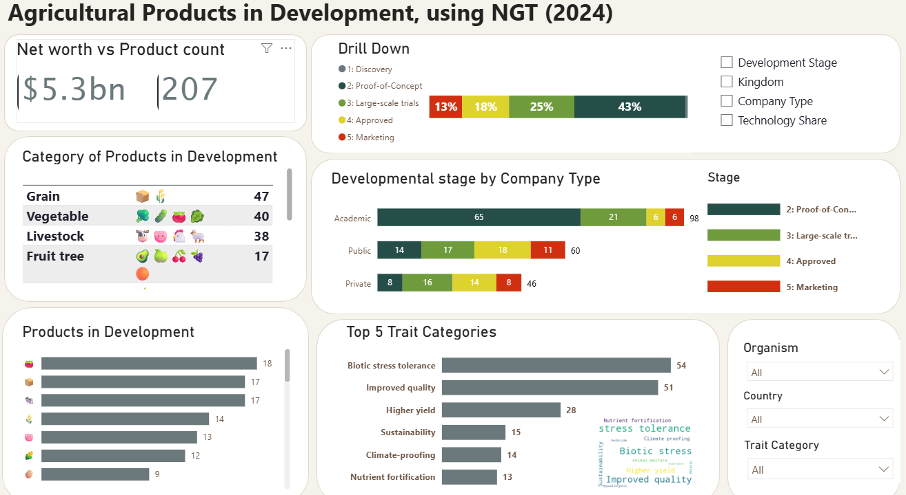
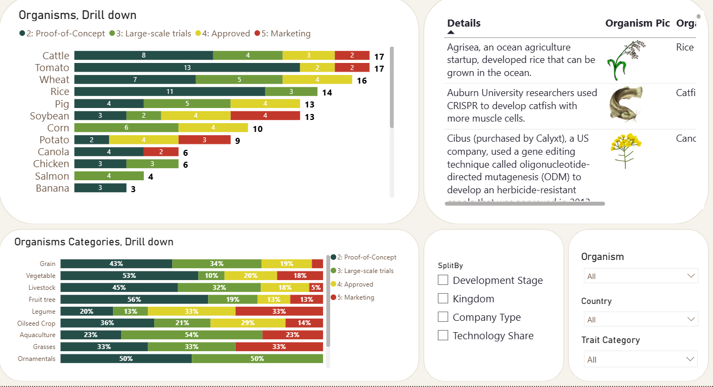

# 🌿 Agricultural Products in Development — NGT Tracker (2024)

An interactive dashboard tracking **206 gene-edited agricultural products** across 60 organisms and 17 countries, built as part of a Power BI → modern web portfolio transition.

**[▶ View Live Dashboard](https://youlia-denisov.github.io/DS-portfolio/gene-editing-tracker/docs/)**

---

## What is NGT?

**New Genomic Techniques (NGT)** — primarily CRISPR/Cas and related tools — allow targeted, precise edits to an organism's own genome without introducing foreign DNA. Unlike traditional GMOs, NGT products are increasingly regulated differently across jurisdictions, making them commercially relevant for agriculture.

This tracker maps the global landscape of NGT-derived products from Discovery to Market, giving a bird's-eye view of where investment, research, and regulatory progress are concentrated.

---

## Dashboard Overview

### Page 1 — Overview



The overview page answers: *what is being developed, by whom, and how far along is it?*

| Panel | What it shows |
|-------|--------------|
| **Net worth vs Product count** | $5.3 bn combined company net worth across 206 tracked products — a proxy for the commercial weight behind this space |
| **Drill Down** | A single stacked bar switchable by Development Stage · Kingdom · Company Type · Technology — quickly surfaces pipeline composition |
| **Category of Products** | Grain (47), Vegetable (40), Livestock (38), Fruit tree (17) — plants dominate but livestock represents a significant share |
| **Products in Development** | Horizontal bar chart ranked by organism count; helps identify which crops/animals attract the most R&D effort |
| **Developmental Stage by Company Type** | Academic institutions drive the largest absolute pipeline (98 products), but private companies are more concentrated in later stages |
| **Top 5 Trait Categories** | Biotic stress tolerance (54) and Improved quality (51) together account for ~50% of all traits — driven by climate pressure and consumer demand |
| **Bar Chart Race** | Animated race chart showing how NGT product counts per organism evolved 2016–2024 |
| **Filters** | Organism · Country · Trait Category — all charts update in real time |

**Key insight:** 43% of tracked products are at Approved or Marketing stage — this is not just a research story, it's an emerging commercial market.

---

### Page 2 — Organism Drill-Down



The second page answers: *which organisms are furthest along, and what does the stage distribution look like within each crop/animal category?*

| Panel | What it shows |
|-------|--------------|
| **Organisms, Drill Down** | Per-organism count split by development stage. Cattle (17), Tomato (17), and Wheat (16) lead — notable that both livestock and staple grains are well-represented |
| **Organisms Categories, Drill Down** | Percentage-stacked view by category. Fruit tree (56% at Proof-of-Concept) and Vegetable (53% PoC) are early-stage heavy; Livestock and Grasses show more advanced-stage products |
| **Details** | Scrollable table with organism image, company description, and applied gene editing technology per product — useful for deep-diving individual entries |

**Key insight:** Aquaculture is an outlier — 54% of products are at Large-scale trials, suggesting a faster path to market than most plant categories.

---

## From Power BI to the Web

This project started as a Power BI report. The web rebuild adds:

- **No license required** — runs entirely in the browser, shareable as a URL
- **World map** — geographic distribution of products by country (not in the original)
- **Bar chart race video** — temporal evolution 2016–2024
- **Responsive layout** — works on desktop and mobile
- **Interactive filters** — organism, country, trait category, all cross-linked

The HTML version is built with **Plotly.js** for charts, **wordcloud2.js** for the trait word cloud, and vanilla JavaScript for data filtering and tab routing — no backend, no server, no build step.

---

## Tech Stack

| Layer | Tool |
|-------|------|
| Original dashboard | Microsoft Power BI |
| Web charts | [Plotly.js 2.27](https://plotly.com/javascript/) |
| Word cloud | [wordcloud2.js](https://github.com/timdream/wordcloud2.js) |
| Typography | Inter (Google Fonts) |
| Data format | JSON embedded in `index.html` |
| Hosting | GitHub Pages |

---

## Data

The dataset was manually compiled from public regulatory databases, academic publications, and company disclosures. Each record includes:

- Organism and category (crop/animal type)
- Development stage (1: Discovery → 5: Marketing)
- Company type (Academic / Public / Private)
- Country of origin
- Trait category (e.g. Biotic stress tolerance, Higher yield)
- Gene editing technology (CRISPR/Cas, ODM, etc.)
- Company net worth (where available)

**Source file:** `data/GE products_short list.xlsx`

---

## Repository Structure

```
gene-editing-tracker/
├── docs/                        # GitHub Pages root
│   ├── index.html               # Interactive web dashboard
│   └── bar_chart_race.mp4       # Animated bar chart race
├── data/
│   └── GE products_short list.xlsx
├── images/                      # Organism images used in the Details panel
│   └── *.png / *.jpg
├── screenshots/                 # Dashboard screenshots (this README)
│   ├── dashboard_overview.png
│   └── organisms_drilldown.png
├── Edited products v2.pbix      # Original Power BI file
└── README.md
```

---

## Running Locally

No dependencies. Just open the HTML file:

```bash
# Clone the repo
git clone https://github.com/youlia-denisov/DS-portfolio.git

# Open in browser
open DS-portfolio/gene-editing-tracker/docs/index.html
```

Or serve it locally to avoid any browser file-protocol restrictions:

```bash
cd gene-editing-tracker/docs
python -m http.server 8000
# → open http://localhost:8000
```
